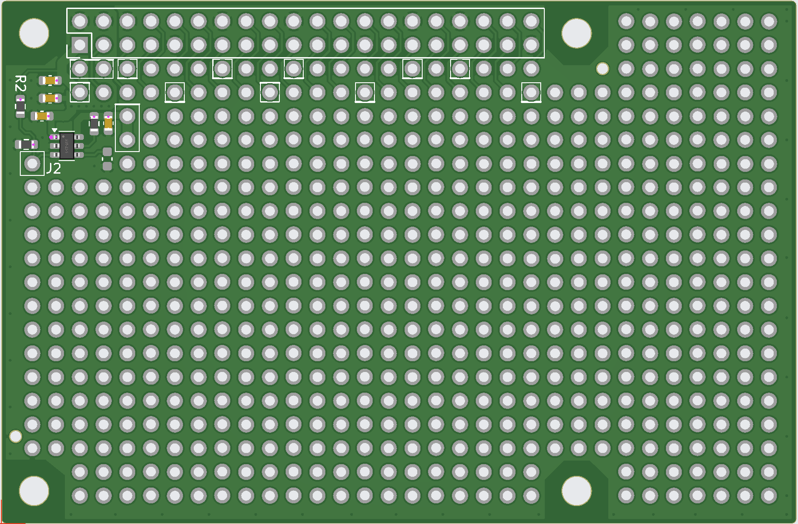
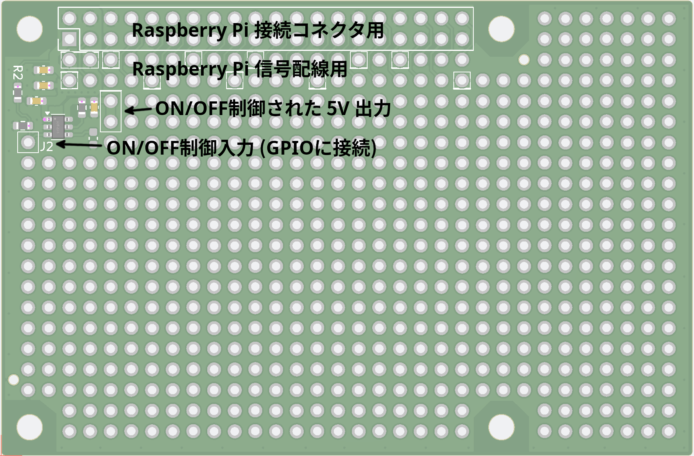

# Rpi-Universal
以下の link を参照ください<br/>
[https://www.zhtelec.com/p/Rpi-Universal](https://www.zhtelec.com/p/Rpi-Universal)
<br/>
<br/>
<br/>
<br/>
+ Raspberry Pi 用ユニバーサル基板<br/>
+ Raspberry Pi 基板サイズと同等<br/>
+ 5V の電源制御回路付 (デフォルトは常時 on)<br/>
+ 電源制御回路により Raspberry Pi 5 の電源 on/off に連動可能<br/>
      (Rpi5 にて "sudo rpi-eeprom-config -e" で "POWER_OFF_ON_HALT=1" の設定が必要)<br/>
+ Raspberry Pi との接続は 13.5mm 高の連結コネクタと 17mm スペーサーが使用可能<br/>






## Documents
+ [Brochure JP](docs/Rpi-Universal-1.01.docJp.pdf)
+ [Schematics](sch/Rpi-Universal-1.01.sch.pdf)

## Configuration files

## Examples (code, setup, etc)
+ GPIO24 (pin 18) を J2 に接続して 5V を制御する方法
```
    sudo gpioset gpiochip4 24=1      # turn on  the 5V
    sudo gpioset gpiochip4 24=0      # turn off the 5V
```

